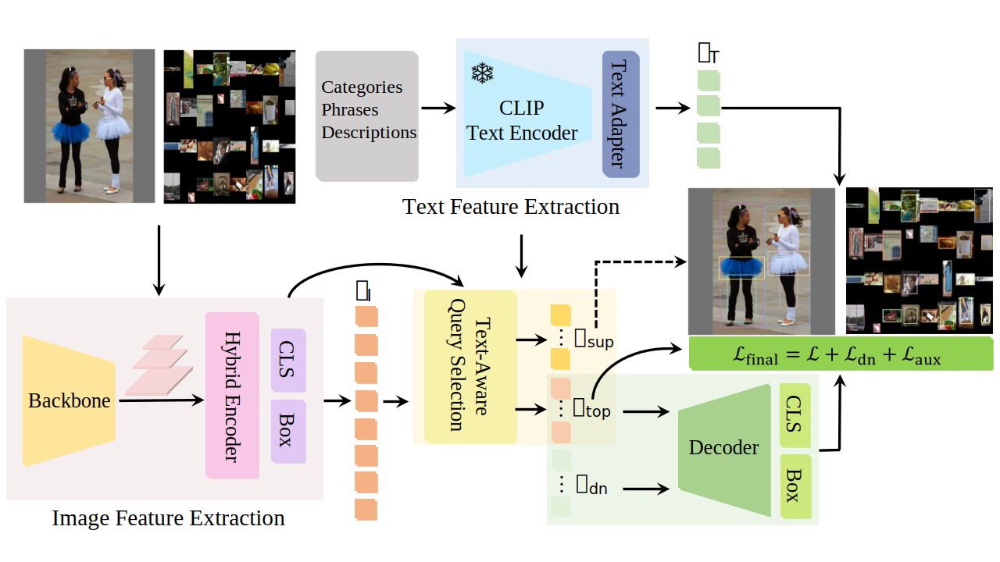
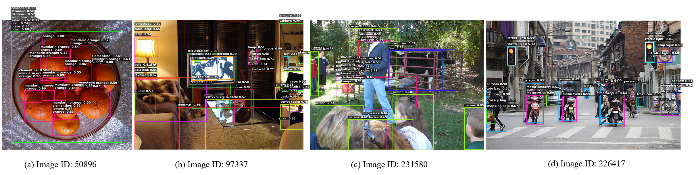

# OV-DEIM: Real-time DETR-Style Open-Vocabulary Object Detection with GridSynthetic Augmentation

### Introduction
**OV-DEIM** is a real-time DETR-style framework for open-vocabulary object detection. It extends DEIMv2 to the open-vocabulary setting and achieves state-of-the-art performance on open-vocabulary benchmarks with superior inference efficiency. The framework is further enhanced by the **Query Supplement** strategy, which improves Fixed AP without sacrificing speed. In addition, **GridSynthetic** is introduced as a data augmentation approach to mitigate noisy localization effects in classification learning and enhance robustness, particularly for **rare categories**.

<details>
  <summary>
  <font size="+1">Abstract</font>
  </summary>
Real-time open-vocabulary object detection faces two key challenges: achieving high inference efficiency and maintaining robust semantic recognition across a large vocabulary. In this work, we present OV-DEIM, an end-to-end DETR-style detector built upon the recent DEIMv2 framework with vision–language modeling for efficient open-vocabulary inference. Unlike YOLO-style detectors, whose category-dependent post-processing cost increases with vocabulary size, OV-DEIM avoids such overhead and scales more gracefully to large vocabularies. This is further supported by a lightweight query supplement strategy that improves Fixed AP without sacrificing inference speed. Beyond architectural efficiency, we focus on strengthening classification robustness. We propose GridSynthetic, a simple yet effective data augmentation method that composes multiple training samples into structured image grids. By exposing the model to richer object co-occurrence patterns and spatial layouts within a single forward pass, GridSynthetic reduces the negative impact of noisy localization signals in the classification loss and enhances semantic discrimination, particularly for rare categories. Importantly, this improvement introduces no additional inference cost. Extensive experiments demonstrate that OV-DEIM achieves state-of-the-art performance on open-vocabulary detection benchmarks, delivering superior efficiency and notable gains on challenging rare categories. Code will be released upon publication.
</details>
<p></p>
<p align="center">
   <br>
</p>


## Table of Content
* [1. Performance](#performance)
* [2. Quick Start](#2-quick-start)
* [3. Acknowledgement](#3-acknowledgement)
* [4. Citation](#4-citation)

## 1. Performance 
### Zero-shot detection evaluation on LVIS
- For training data, OG denotes Objects365v1 and GoldG.
- FPS is measured on T4 with TensorRT
- *Fixed AP* is improved by the **Query Supplement** strategy

| Model | Size | Params | Data | FPS | $\text{AP}$ / $\text{AP}^{\text{Fixed}}$ | $\text{AP}_r$ / $\text{AP}^{\text{Fixed}}$ | $\text{AP}_c$ / $\text{AP}^{\text{Fixed}}$ | $\text{AP}_f$ / $\text{AP}^{\text{Fixed}}$ | Config | Checkpoint |
|---|---|---|---|---|---|---|---|---|---|---|
|OV-DEIM-S|640|11M|OG|161|27.7 / 29.6|23.6 /25.2|28.1 / 30.2 |28.0 / 30.0|[S](./config/dinov3_ori/dinov3_s.py)|[Baidu](https://pan.baidu.com/s/13MdxnfnkOeE1EyQkxqny7w?pwd=tzg6)|
|OV-DEIM-M|640|20M|OG|109|30.6 / 32.6|25.3 /26.9|30.2 / 31.5 |31.9 / 34.1|[M](./config/dinov3_ori/dinov3_m.py)|[Baidu](https://pan.baidu.com/s/13MdxnfnkOeE1EyQkxqny7w?pwd=tzg6)|
|OV-DEIM-L|640|36M|OG|91 |33.7 / 35.9|34.3 /36.8|33.4 / 35.5 |34.0 / 36.0|[L](./config/dinov3_ori/dinov3_l.py)|[Baidu](https://pan.baidu.com/s/13MdxnfnkOeE1EyQkxqny7w?pwd=tzg6)|

### Zero-shot detection evaluation on COCO

| Model | Size | Params | $\text{AP}$ | $\text{AP}_{50}$ | $\text{AP}_{75}$ |
| --- | --- | --- | --- | ---|---|
|OV-DEIM-S|640| 11M| 40.8 | 56.3| 44.4|
|OV-DEIM-M|640| 20M| 43.3| 60.2 | 48.0|
|OV-DEIM-L|640| 36M| 45.9|62.3|49.9|

### Visualizations of zero-shot inference on LVIS

<p></p>
<p align="center">
   <br>
</p>


## 2. Quick Start
### Installation
```
conda create -p ./envs/ovod python=3.10
conda activate ./envs/ovod
pip install torch==2.6.0 torchvision==0.21.0 torchaudio==2.6.0 --index-url https://download.pytorch.org/whl/cu118
pip install hydra-core --upgrade 
pip install albumentations 
pip install opencv-python
pip install lvis
pip install swanlab -i https://mirrors.cernet.edu.cn/pypi/web/simple
swanlab login 
pip install pycocotools
pip install h5py 
```
Locate the line:
```
from lvis import LVIS, LVISEval
```
Navigate to the source file where LVISEval is defined. In that file, modify lines 361 and 362 by replacing np.float with np.float64.

Download the original backbone weights from [DEIMv2](https://github.com/Intellindust-AI-Lab/DEIMv2) and the corresponding [text data](https://pan.baidu.com/s/13MdxnfnkOeE1EyQkxqny7w?pwd=tzg6), where the text embeddings are extracted using [MobileCLIP-B(LT)](https://github.com/apple/ml-mobileclip).


### Data

| Images | Raw Annotations |
|---|---|
| [Objects365v1](https://opendatalab.com/OpenDataLab/Objects365_v1) | [objects365_train.json](https://opendatalab.com/OpenDataLab/Objects365_v1) |
| [GQA](https://nlp.stanford.edu/data/gqa/images.zip) | [	final_mixed_train_noo_coco.json](https://huggingface.co/GLIPModel/GLIP/blob/main/mdetr_annotations/final_mixed_train_no_coco.json)  | 
| [Flickr30k](https://shannon.cs.illinois.edu/DenotationGraph/) | [final_flickr_separateGT_train.json](https://huggingface.co/GLIPModel/GLIP/blob/main/mdetr_annotations/final_flickr_separateGT_train.json) | 

### Pretraining
```
torchrun \
    --nnodes=${NNODES} \
    --nproc_per_node=${NUM_GPUS} \
    --node_rank=${NODE_RANK} \
    --rdzv_backend=c10d \
    --rdzv_endpoint=${MASTER_ADDR}:${MASTER_PORT} \
    train_ori_torchrun.py \
      --config 'base_l' \
      --collate_func "train_collate_final" \
      --pipeline_type 'aug' \
      --batch_size 16 \
      --num_training_classes 150 \
      --alpha 0.5 \
```

## 3. Acknowledgement
The code base is built with [YOLO-World](https://github.com/AILab-CVC/YOLO-World), [YOLOE](https://github.com/THU-MIG/yoloe), [MobileCLIP](https://github.com/apple/ml-mobileclip), [RT-DETR](https://github.com/lyuwenyu/RT-DETR), [DINOv3](https://github.com/facebookresearch/dinov3) and [DEIMv2](https://github.com/Intellindust-AI-Lab/DEIMv2).


## 4. Citation

```

```

